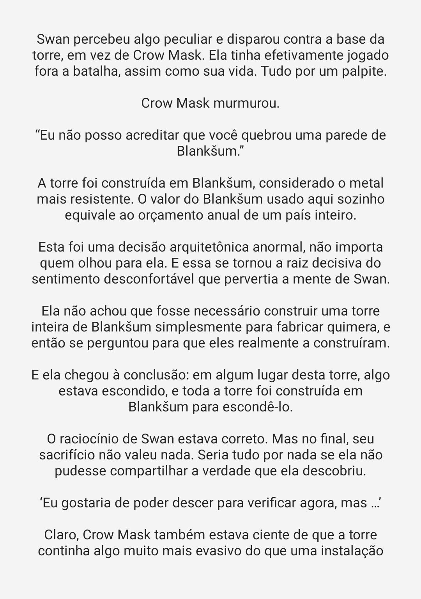

# NovelToManga converter
Kotlin library to convert text to manga pages, with the intention of adding support for novels in [Tachiyomi](https://github.com/tachiyomiorg/tachiyomi) and variants.
## Features
 - Easy to use, pratically plug-and-play
 - No configuration required, it does have good defaults
 - Light, dark and black themes by default
 - Configurable (see Usage)

## Usage
Add this line to your `build.gradle`:
```groovy
dependencies {
    implementation 'com.github.Claudemirovsky:noveltomanga:1.2'
}
```
read about [jitpack](https://jitpack.io) before adding this dependency.
### Using default settings
```kotlin
import android.graphics.Bitmap
import org.claudemirovsky.noveltomanga.NovelToManga
[.....]
val ntm = NovelToManga()
val lines = document.select("span > p").map { it.text() }
val pages: List<Bitmap> = ntm.getMangaPages(lines)
[.....]
```
output:

### Using custom settings
```kotlin
import android.text.Layout
import org.claudemirovsky.noveltomanga.NovelToManga
import org.claudemirovsky.noveltomanga.DefaultThemes
[....]

val ntm = NovelToManga().apply {
    fontSize = 35F
    margin = 75F
    theme = DefaultThemes.LIGHT
    // pageHeight = 1536
    // pageWidth = 1080
    alignment = Layout.Alignment.ALIGN_CENTER
    separateLines = true
}
val lines = document.select("span > p").map { it.text() }
val pages = ntm.getMangaPages(lines)
[.....]
```
output:


I recommend making your tachiyomi-extension class extends `ConfigurableSource`, so you can add preferences to change the appearence of pages.

## TODO
- [x] Speedup bitmap creation
- [x] Make page creation on-demand, without waiting for all pages to be created
- [ ] Better documentation. Currently its almost non-existant xD
- [ ] Add multiple fonts support
